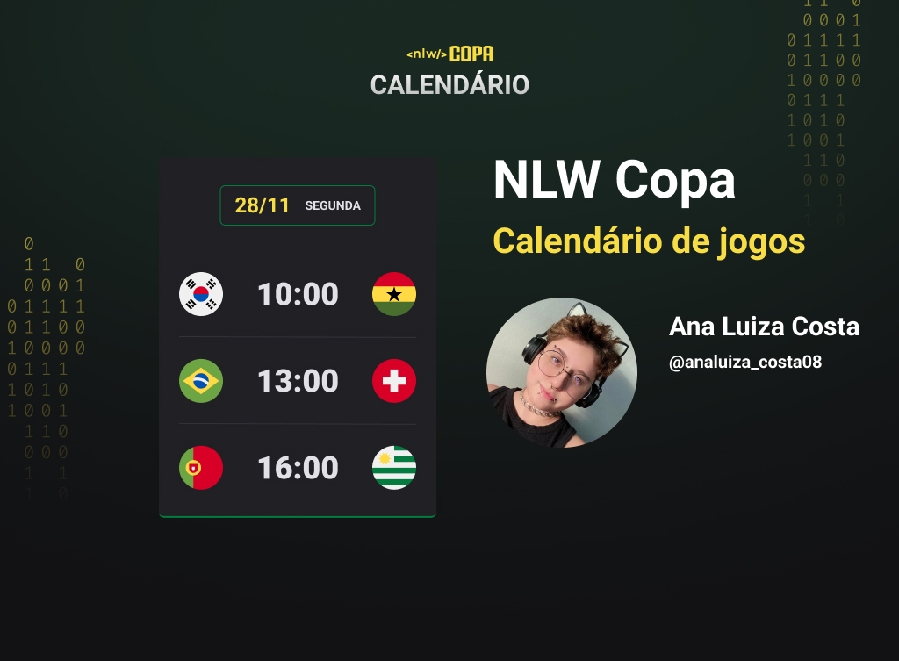

<h1 align="center"> NLW #10 Copa </h1>

 Evento exclusivo e gratuito promovido pelo Rocketseat para ensino de tecnologias WEB. 

 

 <strong> Tecnologias:
<ul><li> HTML </li>
<li> CSS </li>
<li> JavaScript </li>
<li> Git e GitHub </li>
</ul>
</strong>

 O calendário da Copa é um projeto que mostra os jogos da copa de 2022.